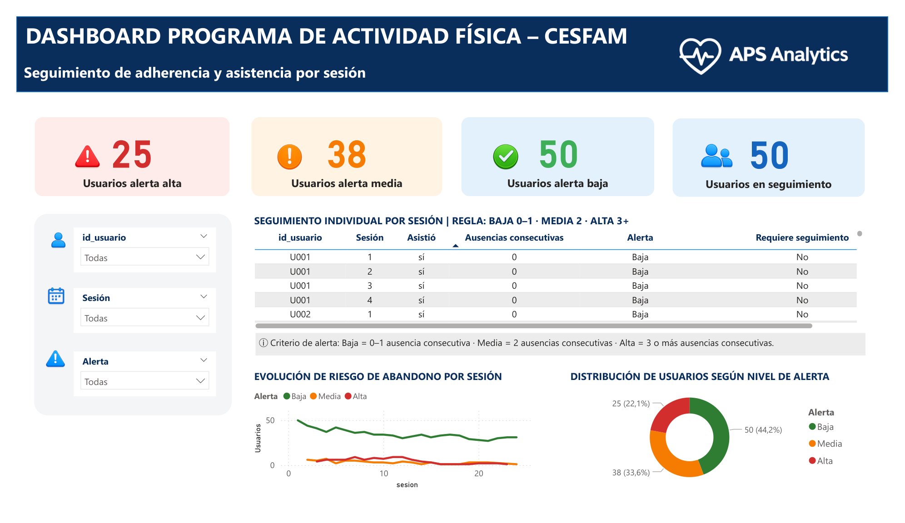

# 🧠 APS Analytics Dashboard  

Adherence and Dropout Risk Analysis in Primary Health Care Programs

---

---

## 🎯 Context

Early dropout is one of the main challenges in Primary Health Care programs.

This project leverages data analytics to monitor participation and detect risk patterns in order to support early intervention.

---

## 🚀 Objective

Build a Power BI dashboard to:

- Track attendance across sessions  
- Identify dropout risk  
- Classify users into alert levels  
- Support data-driven decision making  

---

## 🗂️ Dataset

- Fictional dataset created for demonstration  
- Simulates a 24-session program  
- Includes attendance and adherence metrics  

---

## 📊 Key Insights

- Identification of high-risk users  
- Detection of dropout patterns across sessions  
- Monitoring adherence trends over time  
- Segmentation by alert level  

---

## ⚙️ Data Processing

- Data cleaning and transformation (Power Query)  
- Creation of calculated metrics (DAX)  
- Data modeling for analysis  

---

## 📐 Business Logic

Users are classified based on attendance behavior:

- Consecutive absences increase risk  
- Alert levels:
  - 🟢 Low  
  - 🟠 Medium  
  - 🔴 High  

---

## 🛠️ Tools

- Power BI  
- Excel  
- Power Query  
- DAX  

---

## 🔒 Ethical Consideration

This project uses a fully fictional dataset.  
No real patient or institutional data is included.

---

## 👩‍💻 Author

**Camila Álvarez**  
Physical Activity Specialist, Workplace Wellness & People Analytics  
GitHub: https://github.com/Cami2025

# Contact

LinkedIn: www.linkedin.com/in/camilaalvareztafs

Professional email: camianalytics5@gmail.com

---

## ⭐ Support the Project

If you found this project useful, feel free to give the repository a **⭐ star**!  
Your support helps showcase my work and encourages the creation of more analytics projects.